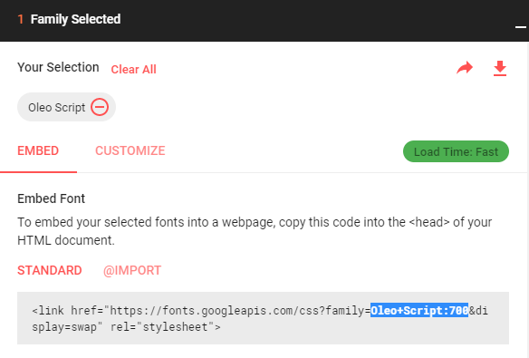
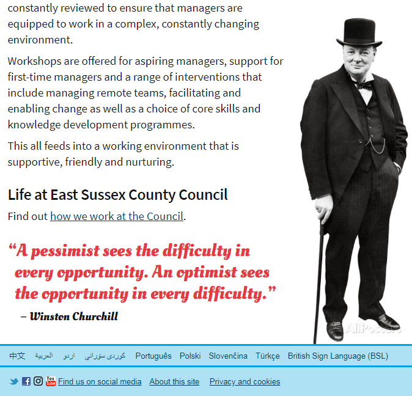

# Campaigns

The 'Campaign landing', 'Campaign content' and 'Campaign tiles' document types and templates are designed for use in marketing campaigns. They are more graphical than our standard templates, and support the use of custom colours and graphics developed for the campaign to visually tie them to campaign materials used in other media.

They are now used beyond marketing campaigns as a way to give certain sections of the site their own unique design.

All of the document types include 'Custom CSS' properties where raw CSS can be entered for small, medium and large screens, reflecting the [standard small, medium and large media queries](https://www.eastsussex.gov.uk/styleguide/Grid) used on our website. In addition, the most commonly altered CSS properties on each template are made available as additional Umbraco properties on the document type to make them easier to edit without understanding CSS syntax.

Each template uses [ClientDependency](https://github.com/Shazwazza/ClientDependency) to load the current page URL again, but with a querystring beginning with `?altTemplate={CssTemplateName}`. This happens three times - once for each media query. It uses a feature of Umbraco called 'Alternative templates'. Each request uses the same controller as the page itself to get the property values from Umbraco (if you debug the controller you'll notice it execute four times for each page view), but then displays those properties with the view named in the `altTemplate` parameter. In this case the alternative template returns a dynamically-generated CSS file that contains CSS properties set using the Umbraco properties. These use the CSS cascade to override the default styles for the page and create a unique look.

A number of properties allow the colours of specific elements to be changed. These use the [Spectrum Colour Picker for Umbraco 7](https://github.com/robertjf/UmbColourPicker), which is included in this repository in `~\App_Plugins\SpectrumColorPicker` because at the time it was not available as a NuGet package.

## Campaign landing

This is the most customisable template. 

### Background images
The entire background of the page can be changed, with a background colour overlaid by separate background images for small, medium and large screens. 

* Background images for small screens should be 474px wide (or tile up to at least that width), but should expect that only a central area which may be as small as 320px will be displayed on some devices. 
* Background images for medium screens should be 802px wide (or tile up to at least that width), but should expect that only a central area which may be as small as 475px will be displayed on some devices. 
* Background images for large screens should expect that only a central area which may be as small as 803px will be displayed on some devices, but that the width of other devices may be very large. If the screen is larger than the selected image, there is a Umbraco property on the document type to choose whether the image will tile or display the selected background colour on either side and below.

Background images should be tested at the full range of sizes by resizing the browser, and by changing the text size within the browser. The layout of text overlaying the image will change, and the background image must allow for this variation to occur while ensuring the text remains legible and accessible.

### Navigation styles
'Campaign landing' pages can include two alternative types of navigation (don't use both on one page):

*  Landing navigation - these are the same links on a blue background that are used on the 'Landing' template, though here they can have the colour and background changed.
*  Button navigation - these are individually coloured buttons with descriptions which expand to fill the width of the page. 

### Google Ads campaign tracking

Campaigns are sometimes promoted using [Google Ads](https://ads.google.com), so to track the success of an advert the Google Ads tag code can be pasted into the `Google AdWords tag` property on the 'Properties' tab of the 'Campaign landing' document type. 

The Google Ads tag code is parsed by `GoogleAdWordsTagParser` so that the standard `<script />` element can be replaced with one that specifies a nonce for the Content Security Policy, then the Content Security Policy is updated and the amended tag code is inserted into the page.

## Campaign content

Background images on this template will be displayed as a header above the breadcrumb trail and `h1` element. The image widths should be the same as the background images for the 'Campaign landing' template above.

This template is designed to display pull quotes alongside text-based content. Colours are customisable for the pull quotes and any font from [Google Fonts](https://fonts.google.com) can be used. To specify a custom font copy the family name (for example `Oleo+Script:700`) from the 'Embed' code supplied once you select a font on Google Fonts, and paste it into the `Quotes: font-family` Umbraco property for the page.

Upper and lower pull quotes appear within the text on small screens, but alongside the text in the right column on large screens:

The central pull quote fills the width of the page. On larger screens the image expands outside the top of its container:

The lower pull quote is designed to work with a cutout image of the speaker, 310px wide, which is aligned to the page footer:

## Campaign tiles 

Background images on this template will be displayed as a header above the breadcrumb trail and `h1` element. The image widths should be the same as the background images for the 'Campaign landing' template above.

As this template pre-dates Nested Content being available in Umbraco core, it uses separate properties to support up to 12 image-based tiles. The images for the tiles are specified using a  'Multiple Media Picker' property editor. The links that go with the image use a 'Related Links' property editor. There are 12 separate properties for tile descriptions. The first image goes with the first link and first description, and so on.  Images are automatically rounded using CSS `border-radius: 50%`.

