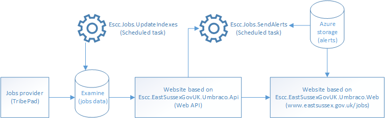

# Jobs

The job search section of our website is powered by [Examine](https://github.com/shazwazza/Examine/), which is based on [Lucene](https://lucene.apache.org/).

It is loosely coupled to the council's recruitment management software provider, which is currently TribePad. When the council changes its provider, we can simply create a new indexing provider and leave the rest of our jobs pages unchanged. This also allows us to improve our jobs pages without being limited by the current provider's API.

*  `Escc.Jobs.UpdateIndexes` is a scheduled task which reads jobs data from our current jobs provider and writes it to an Examine index. This is the only interaction with the jobs provider. 
*  `Escc.EastSussexGovUK.Umbraco.Api` reads data from Examine and makes it available as a Web API.
*  `Escc.EastSussexGovUK.Umbraco.Web` reads data from the Web API to provide the jobs website pages, including subscribing to job alerts.
*  `Escc.Jobs.SendAlerts` is a scheduled task which reads jobs data from the Web API and job alerts data from Azure storage to send job alerts. 

## Importing the data

The first step is to get the data from our external jobs provider into Examine. This happens by configuring an index set called `PublicJobsIndexSet` in `~\config\ExamineIndex.config`, and an index provider called `PublicJobsIndexer` in `~\config\ExamineSettings.config`. 

The `PublicJobsIndexer` index provider configuration points to the `PublicJobsIndexer` class, which is instantiated by Umbraco to build or rebuild the index. It fetches the data from our external jobs provider (which is just an instance of `IJobsDataProvider`), using source URLs that come from settings in the `appSettings` section of `web.config` that are unique to the specific `IJobsDataProvider`, and puts it into Examine.

The settings for the current provider, TribePad, are:

	<appSettings>
	    <add key="TribePadLookupValuesUrl" value="https://hostname/example" />
	    <add key="TribePadPublicJobsResultsUrls" value="https://hostname/example,https://hostname/example" />
	    <add key="TribePadAdvertUrl" value="https://hostname/example" />
	    <add key="TribePadRedeploymentJobsResultsUrls" value="https://hostname/example,https://hostname/example"/>
	    <add key="TribePadApplyUrl" value="https://hostname/example" />
	  </appSettings>

We then have a second index set called `PublicJobsLookupValuesIndexSet` and an index provider called `PublicJobsLookupValuesIndexer` with a matching class. This reads lookup values from our external jobs provider, such as the list of towns where jobs can be based, but also searches the `PublicJobsIndexSet` for each one and records how many results it finds. For this reason the `PublicJobsLookupValuesIndexSet` must *always* be built or rebuilt after `PublicJobsIndexSet`.

We have a second set of jobs which are open only to applicants who are eligible for redeployment, so we repeat the above process to create two more index sets and indexers with the prefix `RedeploymentJobs` instead of `PublicJobs`. These work in exactly the same way but based on a different data source.

You can recreate the configuration for these index sets and indexes by applying the `ExamineIndex.config.xdt` and `ExamineSettings.config.xdt` transforms to your own installation of this project. You will need both files from `Escc.EastSussexGovUK.Jobs.Api\Jobs\Examine` and another `ExamineSettings.config.xdt` from a provider-specific sibling folder.

The domain is automatically removed from image URLs in job adverts, as images are expected to be loaded from the same domain as the website. However, this is a problem in test environments where the images are not present, so you can disable this behaviour in `web.config`:

	<appSettings>
	    <add key="DoNotRemoveMediaDomainInJobAdverts" value="true"/>
	</appSettings>

### Updating the data

To update the jobs data you need a trigger a reindex for each of the index sets. You can do this in one of the following ways:

* The recommended way is to run `Escc.Jobs.UpdateIndexes.exe`, which calls the `JobsIndexerApiController` to rebuild all of the jobs indexes in the correct order. This requires you to authenticate using the approach documented for  [Escc.BasicAuthentication.WebApi](https://github.com/east-sussex-county-council/Escc.BasicAuthentication.WebApi). `Escc.Jobs.UpdateIndexes.exe` is expected to be set up as a scheduled task (or web job on Microsoft Azure), so that jobs data is regularly updated from the external jobs provider. You also have the option of running this task manually to trigger an update.
* You can call the `JobsIndexerApiController` Web API from some other client. 
* Sign into Umbraco with administrator permissions and navigate to Developer > Examine Management > Indexers > [select the indexer to update] > Index info & tools > Rebuild index

If the data source is unavailable during a reindex the jobs data we already have will be lost, so we will have no data to display. Unfortunately this behaviour is built into the way Umbraco calls the `ISimpleDataService` interface. 

## Searching the data

### How the Web API searches data in Examine

A `PublicJobsSearcher` and `PublicJobsLookupValuesSearcher` are configured in `~\config\ExamineSettings.config` linking to the index sets set up above. Equivalent searchers are also created for redeployment jobs.

The `JobsDataFromExamine` class implements `IJobsDataProvider` and provides methods to query the jobs data in Examine. You need to provide it a reference to either the `PublicJobsSearcher` or the `RedeploymentJobsSearcher` so that it knows which index set to search.

Searching this data in Examine rather than directly from our external jobs provider allows us to adjust the way the search behaves by writing our own queries in Lucene syntax.

### Always read from the Web API to support load-balancing

When Umbraco updates its internal Examine indexes it does so across all load-balanced servers. This doesn't happen with the `ISimpleDataService` interface used by jobs, so only the local index is updated. This is a problem in a load-balanced scenario unless you are able to trigger an update on every load-balanced server in the farm.

To allow load-balancing to be used, the jobs API built into the `Escc.EastSussexGovUK.Umbraco.Api` project should be hosted on a non-load-balanced server, and the jobs data on that server should be kept up-to-date as described above. Load-balanced front-end servers should read data using `JobsDataFromApi` and specify the API server URL in `web.config`:

	<appSettings>
	    <add key="JobsApiBaseUrl" value="https://hostname"/>
	</appSettings> 

We don't want the overhead of reading from a remote API all the time though, so jobs data is cached in memory for 1 hour. This happens on a query-by-query basis, so the expiration time is 1 hour from when the same query was last run. There are three exceptions to this:

* if it is less than 1 hour until midnight, then the cache will expire at midnight, as we don't want to list jobs after applications close
*  the `Problem jobs` RSS feed (see below) is not cached, as the query is not expected to be run frequently
*  adding `ForceCacheRefresh=1` to the querystring of any jobs page will force the jobs cache to be cleared and new data to be fetched from the API and inserted into the cache

### The full set of search parameters

Job searches are serialised/deserialised by `JobSearchQueryConverter` as a querystring containing the search parameters. This is used to pass a search from page to page, and to store a search in a job alert. The querystring is converted back to a `JobSearchQuery` when it needs to be executed.

Most of the search parameters are generated by fields on the advanced search page, based on the 'Jobs search' document type in Umbraco. These are named to match the properties of `JobSearchQuery` so that they can be used with MVC model binding. However, others exist to enable specific features (like filtering the jobs to be tweeted) or for use in analytics. The supported parameters are:

*  `?keywords={individual words, or a phrase "in quotes"}`
*  `?locations={town}`
*  `?jobtypes={category name}`
*  `?department={department name}`
*  `?org={organisation name}`
*  `?salaryranges={£12345+to+£23456}`
*  `?paygrades={named pay scale}`
*  `?ref={job reference}`
*  `?contracttypes={permanent}`
*  `?workpatterns={full-time}`
*  `?closingdatefrom={YYYY-MM-DD}`
*  `?sort={columnascending}`
*  `?page={int}`
*  `?pagesize={int}`

Multiple values should be specified using two parameters, eg for jobs in Lewes *or* Eastbourne use `?locations=Lewes&locations=Eastbourne`.

## Umbraco document types for jobs

A series of Umbraco document types and templates can be used to build up a jobs site from Umbraco content. These could work with any implementation of `IJobsDataProvider` and have properties to connect one page to another (for example, the search page to the search results page) rather than hard-coding the connections between them. This has three advantages:

* Umbraco users can create their own information architecture for jobs
* Parallel sites can be created for public jobs and redeployment jobs
* Features are be turned on or off on each page depending on which connections have been made. For example, linking from the search results page to the RSS feed enables a link to the results of the same search as RSS.

Just one instance of the `Job advert` document type is required to display any job. This works because the `JobAdvertContentFinder`, hooked up in `JobAdvertEventHandler`, recognises the URL of this page when it has an id and job title appended. For example when `/job-advert` is accessed as `/job-advert/12345/teacher-at-example-school`. The id is used to look up and display the job, and the job title (and anything else after the id) is there purely for SEO and use in analytics.

### Tabs on job adverts

The `Job advert` template includes tabs at the bottom of the page. If you resize your browser you will see this change to an accordion at small screen sizes. This works using `accordion-and-tabs.js` in the [Escc.EastSussexGovUK](https://github.com/east-sussex-county-council/Escc.EastSussexGovUK) project. 

`JobAdvert.cshtml` uses [Escc.ClientDependencyFramework](https://github.com/east-sussex-county-council/Escc.ClientDependencyFramework) to locate this file in `web.config`. The entry in `web.config` comes from the `Escc.EastSussexGovUK.ClientDependency` NuGet package in the [Escc.EastSussexGovUK](https://github.com/east-sussex-county-council/Escc.EastSussexGovUK) project.

### Showing similar jobs when a job has expired

If the `JobAdvertContentFinder` recognises a URL as a job advert but the job cannot be found, it is assumed that the closing date has passed and the job has expired. Rather than presenting a standard 404 page, this is an opportunity to target someone who is looking for a particular kind of job, so we return a 410 to indicate the job has gone but show them a list of similar jobs based on the job information we can see in the URL they requested. This happens in the `JobAdvertController` and `~\Views\JobAdvert.cshtml` view.  

## Job alerts

Subscriptions to job alerts are saved in a `IJobAlertsRepository`, with the current implementation using Azure table storage. Each alert consists of a search query (serialised as a query string), an email address, and the frequency with which to send the alert.

You need to set an Azure storage connection string in `~\Escc.EastSussexGovUK.Umbraco.Web\web.config` otherwise alerts will not be saved correctly:

	<configuration>
		<connectionStrings>
		    <add name="Escc.EastSussexGovUK.Umbraco.AzureStorage" connectionString="DefaultEndpointsProtocol=https;AccountName=YOURACCOUNTNAME;AccountKey=YOURACCOUNTKEY" />
	  	</connectionStrings>
	</configuration>

### Sending alerts

Alerts are sent by a console application, `Escc.Jobs.SendAlerts.exe`, which can be called by a scheduled task such as an Azure web job. This requires the same Azure storage connection string in its `app.config` file, except that the connection string should be called `JobAlerts.AzureStorage`. 

We also store which jobs were sent to which email address, without specifying which alert it matched, so that we do not send the same job to the same person twice even if it matches a different alert to the one we originally sent it for.

The formatting of the alert emails is controlled by a combination of the alert templates `JobAlertConfirmation.html` and `JobAlert.html`, and text entered into an instance of the `Job alerts` document type in Umbraco. The latter allows editors to update the content of the alerts without requiring a developer.

Because Azure does not support SMTP by default, sending email is done using the approach described in [Escc.AzureEmailForwarder](https://github.com/east-sussex-county-council/Escc.AzureEmailForwarder).

### Translating obsolete job types
Job alerts can contain searches for job types that have become obsolete, so to keep old searches working we need to support a list of translations from old job types to new. However, when preparing to transfer to a new jobs provider it can be useful to delay activating this feature so that it does not apply to the old provider. Therefore this feature is only active when the following setting is in `web.config` of the `Escc.EastSussexGovUK.Umbraco.Api`, `Escc.EastSussexGovUK.Umbraco.Web` and `Escc.Jobs.SendAlerts` projects.

	<appSettings>
    	<add key="TranslateObsoleteJobTypes" value="true" />
    </appSettings>

## Jobs RSS feed (or how to use jobs data elsewhere)

If you create an instance of the 'Jobs RSS' document type in Umbraco, and then select that instance from the appropriate property on the 'Job search results' page, you create an RSS feed which supports all the same filters as the job search page using the same query string parameters. 

As well as providing an RSS feed people can subscribe to themselves, this enables several other features:

### Embedding a list of jobs in another page

A live list of jobs can be included in any Umbraco page. Work out a search query that lists only the jobs you want to show, then copy the RSS URL from the alerts section on the job search results page. In the Umbraco page create a link to that URL, select the link and apply `RSS` and `Embed jobs RSS feed` from the `Formats` dropdown in the rich text editor. The list of jobs is embedded in the page as a table.

This works because:

1. The `RSS` and `Embed jobs RSS feed` formats are set up in `TinyMCE-StyleSelector-Embed.css`, which is selected for use in the data type for the rich text editor.
2. Applying those formats creates a `span` around the link with two classes: `rss` and `embed-jobs-rss`.
3. The script `embed-jobs-rss.js` is included in every page by `UmbracoDesktop.cshtml`. It looks for a `span` using those two classes and replaces it with the content of the RSS feed, found using the link that's inside the `span`.
4. Since the RSS feed is an Umbraco document type, it can be rendered by multiple templates. `embed-jobs-rss.js` appends `altTemplate=JobsRssAsTable` to the link before downloading it, which renders the data for the RSS feed using `~/Views/JobsRssAsTable.cshtml`. The RSS feed document type returns all matching jobs, not paged data, but the `JobsRssAsTable.cshtml` view formats the jobs in an HTML table ready to be embedded, rather than as an RSS feed.

### Exporting jobs to Indeed.com

Since the RSS feed is an Umbraco document type, it can be rendered by multiple templates. Append `?alttemplate=JobsRssAsIndeedXml` to the RSS feed link and the data will be rendered by `~\Views\JobsRssAsIndeedXml.cshtml` which formats the data as an [Indeed.com XML Job Feed](http://techdocs.indeedeng.io/xml-job-feed/), which enables them to better index our jobs. It also allows us to add Google Analytics campaign tracking to the links in the feed so that we can identify traffic coming from adverts shown on Indeed.com.

### Exporting jobs as tweets

Since the RSS feed is an Umbraco document type, it can be rendered by multiple templates. Append `?alttemplate=JobsRssAsTweets` to the RSS feed link and the data will be rendered by `~\Views\JobsRssAsTweets.cshtml` which formats the data as a spreadsheet which can be uploaded to HootSuite as a set of draft tweets with timings. 

## Reporting problems with missing data

Job searches work best when jobs contain complete and consistent data, but this doesn't always happen. To help recruitment staff spot issues created by missing data, the `Problem jobs` document type creates an RSS feed of jobs that may have missing data. Recruitment staff can subscribe to this feed using a site like [Blogtrottr](https://blogtrottr.com/) to get notified of problems as new jobs are posted.