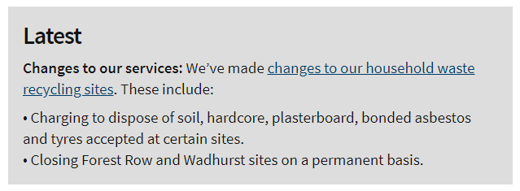

# Latest section

Most document types support a 'Latest' section. This is designed to highlight updates relevant to a particular page or section, such as a consultation. It should be kept short, and link to a page if more detail is required.

It supports a combination of 'inherit' and 'cascade' settings and its own publish and unpublish dates, which allows editors to enter an update once and have it appear across an entire section, while retaining fine control over how far it extends and any pages which might need a different or additional message.

 It is not designed for emergencies such as downtime and closures - use [Service alerts](ServiceAlerts.md) for that.

## Create the properties on each supporting document type

Wherever you want to configure 'Latest' text you need to create a tab on the document type called 'Latest' with the following properties:

*  Create a data type called `Latest` using the `Rich text editor (ESCC)` property editor. Allow bold, bulleted and numbered lists, and links. Enable only the `TinyMCE-Content` stylesheet, all of the custom validators except `Contains only links` and all of the custom formatters except `Format content as two lists of links`. Create a property with the alias `latest_Latest` that uses this data type.
*  Create a date property called `Latest: publish date` with the alias `latestPublishDate_latest`.
*  Create a date property called `Latest: unpublish date` with the alias `latestUnpublishDate_Latest`.
*  Create a checkbox property called `Latest: inherit?` with the alias `latestInherit_Latest`. It should be checked by default.
*  Create a checkbox property called `Latest: cascade?` with the alias `latestCascade_Latest`. It should be checked by default.

In a new installation you would create this set of fields as a separate document type and add it as a [composition](https://our.umbraco.com/documentation/Getting-Started/Data/Defining-content/#creating-a-document-type) to other document types. However, this was set up before compositions were available in Umbraco, so the fields are defined separately on different document types, including some parent document types (which is a feature replaced by compositions).

## How it works

Editors can type their 'Latest' content into the `latest_Latest` field on any document type where it's been added.

Each controller that needs to support a 'Latest' should create an instance of `UmbracoLatestService`, and usually pass it to `BaseViewModelBuilder.PopulateBaseViewModelWithInheritedContent()`. This evaluates the 'inherit' and 'cascade' properties, recursing up the hierarchy of content nodes to build a combined text to display for the 'Latest'.

Because a 'Latest` can also have a start or end date that differs from that of the page it's on, it needs to be considered when deciding how long to allow browsers the cache the response. The 'Latest' may expire before the rest of the page.  

	public new async Task<ActionResult> Index(RenderModel model)
    {
		var viewModel = new MyCustomModel();

		// Populate the view model with details of the 'Latest'
		var templateRequest = new EastSussexGovUKTemplateRequest(Request);
		var modelBuilder = new BaseViewModelBuilder(templateRequest);
		modelBuilder.PopulateBaseViewModelWithInheritedContent(viewModel, 
                new UmbracoLatestService(model.Content), null, null, null, null);

		// Get the expiry date for the page from Examine
        var expiryDate = new ExpiryDateFromExamine(model.Content.Id, ExamineManager.Instance.SearchProviderCollection["ExternalSearcher"], new ExpiryDateMemoryCache(TimeSpan.FromHours(1)));

		// Get the expiry date for the 'Latest'
		var latestExpiry = new ExpiryDateFromPropertyValue(model.Content, "latestUnpublishDate_Latest");

		// Configure HTTP caching for the page, considering both expiry dates
		var httpCaching = new HttpCachingService(); 
        httpCaching.SetHttpCacheHeadersFromUmbracoContent(model.Content,
		 	UmbracoContext.Current.InPreviewMode, 
			Response.Cache, 
			new IExpiryDateSource[] { expiryDate, latestExpiry }
		);

        return CurrentTemplate(viewModel);
	}

The result of this is that `viewModel.Latest` is set to an HTML string (which may be `null` if there is no 'Latest' to display.). Any template which supports displaying a 'Latest' should include the following line immediately after the `<h1></h1>` element, which formats the 'Latest' in a consistent way:

    @Html.Partial("~/Views/EastSussexGovUK/Features/_Latest.cshtml")

Note that some document types (for example, the home page) may allow entry of 'Latest' settings without displaying them. This makes sense as the 'Latest' might be configured to cascade to all pages below that page.