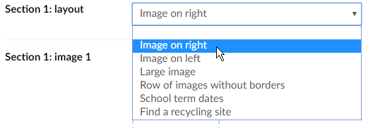
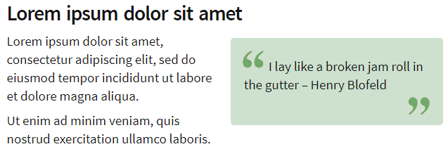

# WebForms templates migrated from Microsoft CMS

This site used to use WebForms templates in Microsoft CMS. For the conversion to Umbraco the existing templates were converted to ASCX usercontrols which can be loaded by the Razor view for the equivalent Umbraco template. 

The controls in the `Escc.EastSussexGovUK.Umbraco.MicrosoftCmsMigration` namespace replicate the original Microsoft CMS controls as closely as possible, with the code altered only to get their data from Umbraco content nodes instead. This ensured that the migration was as smooth as possible, with all the template logic preserved.

The Umbraco templates set up as equivalents of the old Microsoft CMS templates all use `MicrosoftCmsPageController` and `MicrosoftCmsViewModel`. These are as minimal as possible, leaving most of the page logic to the original controls.

`MicrosoftCmsUrlRedirectionHandler` exists to redirect old Microsoft CMS URLs, which all ended in `.htm`, to their nearest equivalent in Umbraco, making the assumption that the replacement page is most likely found at the same URL. If it's not there (because a lot of changes have happened since then) then the usual 404 page will be displayed when Umbraco cannot find the redirected URL.

The handler must be configured in `web.config` as follows:

	<system.webServer>
	  <handlers>
      	<add name="MicrosoftCmsUrlRedirection" verb="GET" path="*.htm" type="Escc.EastSussexGovUK.Umbraco.Web.MicrosoftCmsMigration.MicrosoftCmsUrlRedirectionHandler, Escc.EastSussexGovUK.Umbraco.Web" />
	  </handlers>
	</system.webServer>
  
## Standard topic page 

The standard topic page is a general purpose template that tries to offer similar flexibility to the Umbraco grid data type, but it was built within the limitations of Microsoft CMS which was not designed to work that way.

Sections 1 to 6 of the 'Standard topic page' contain a repeated set of properties that support a number of different layouts. Not every layout will use all of the properties. The first property in each section is a choice of which layout to apply:

This list of layouts is read from `web.config`:

	<configuration>
	  <configSections>
		<sectionGroup name="Escc.EastSussexGovUK.Umbraco">
	      <section name="TopicSectionLayouts" type="Escc.EastSussexGovUK.Umbraco.Web.Views.Topic.SectionLayoutConfigurationSection, Escc.EastSussexGovUK.Umbraco.Web" />
	    </sectionGroup>
	  </configSections>
	  <Escc.EastSussexGovUK.Umbraco>
	    <TopicSectionLayouts>
	      <SectionLayouts>
	        <add name="Normal" displayName="Image on right" displayControl="~/Views/Topic/TopicSection_Normal.ascx" />
	        <add name="Alternative" displayName="Image on left" displayControl="~/Views/Topic/TopicSection_Alternative.ascx" />
	        <add name="FeaturedImage" displayName="Large image" displayControl="~/Views/Topic/TopicSection_FeaturedImage.ascx" />
	        <add name="ImageRowBorderless" displayName="Row of images without borders" displayControl="~/Views/Topic/TopicSection_ImageRowBorderless.ascx" />
	        <add name="TermDates" displayName="School term dates" displayControl="~/Views/Topic/TopicSection_TermDates.ascx" />
	        <add name="RecyclingSiteSearch" displayName="Find a recycling site" displayControl="~/Views/Topic/TopicSection_RecyclingSiteFinder.ascx" />
	      </SectionLayouts>
	    </TopicSectionLayouts>
	  </Escc.EastSussexGovUK.Umbraco>
	</configuration>

The `web.config` entry for each layout points to a WebForms usercontrol which renders the section, using some or all of the remaining properties in the section. Also in the `~\Views\Topic` folder are several classes to support this choice of sections.

'**School term dates**' and '**Find a recycling site**' are special cases, as they completely ignore all the other properties in the section. These are designed to include some very specific code intended only to be used once on the whole website, in the middle of an otherwise generic template. 'Find a recycling site' does not even belong to this project - it is imported by the `Escc.RubbishAndRecycling.SiteFinder` NuGet package from the [Escc.RubbishAndRecycling.SiteFinder](https://github.com/east-sussex-county-council/Escc.RubbishAndRecycling.SiteFinder) project.

Sections 7 to 20 of the 'Standard topic page' are simply a heading and rich text box for additional content with standard formatting. It was decided that 6 customisable sections were enough.

### School term dates

Term dates are stored as XML so that they can be [made available as open data](http://data.gov.uk/dataset/east-sussex-county-council-term-dates).

This is an example of the XML format, showing the three possible time periods: terms, holidays and INSET days.

	<TermDates>
	  <SchoolYear startYear="2012">
	    <Holiday name="Summer holiday" startDate="2012-07-23" endDate="2012-09-03" />
	    <InsetDay name="INSET day" startDate="2012-09-04" endDate="2012-09-04" />
	    <Term name="Term 1" startDate="2012-09-05" endDate="2012-10-26" />
	  </SchoolYear>
	</TermDates>

1. Upload the term dates data to the Umbraco media library.
2. On a topic page, select 'Term dates' as a section layout
3. In the same section, select the term dates data in the 'Section [number]: image 1' field. All other fields in the section are ignored.

If no term dates data is selected, the term dates section is left blank. If the wrong kind of file is selected an `XmlException` is thrown with the message "Invalid character in the given encoding. Line 1, position 1."

### Pull quotes on the 'Standard topic page'

'Standard topic page' supports pull quotes in a way not supported by any other template.

All of the rich text editor properties on the 'Standard topic page' document type use a dedicated 'Rich text: Standard topic page' data type. Installing the [Escc.Umbraco.PropertyEditors](https://github.com/east-sussex-county-council/Escc.Umbraco.PropertyEditors) NuGet package from our private feed makes available the the `Rich text editor (ESCC)` property editor, which is used on all rich text data types. 

However, it also updates `~\config\tinymceconfig.config` to make a custom Blockquote button available to the TinyMCE editor, and only the 'Rich text: Standard topic page' data type has this button enabled. The pull quote is a standard `<blockquote>` element inserted into the page and styled by `topic-small.css` and `topic-medium.css`.

## Map

The `Map` document type is designed to host an image map, but doesn't include an image map designer. Instead editors should be advised to use an online image map creator such as [image-map.net](https://www.image-map.net/) and paste in HTML similar to the following:

	<map name="Map" id="Map">
		<area title="Eastbourne Borough Council" shape="poly" alt="Eastbourne Borough Council" coords="205,297,187,295,190,284,192,271,195,254,214,250,221,246,239,258,251,266,269,266,270,285,248,285,230,285,214,285" href="#eastbourne" />
		<area title="Hastings Borough Council" shape="poly" alt="Hastings Borough Council" coords="299,233,299,228,305,220,308,213,312,195,350,200,382,205,364,210,382,210,383,231,329,232,331,221,325,227,312,227" href="#hastings" />
		<area title="Rother District Council" shape="poly" alt="Rother District Council" coords="429,175,374,202,310,191,297,231,255,240,256,229,281,213,278,191,252,190,233,129,262,79,286,94,290,104,314,111,325,120,344,112,374,115,409,128,425,153,436,151,450,171" href="#rother" />
		<area title="Wealden District Council" shape="poly" alt="Wealden District Council" coords="159,34,162,51,185,43,201,33,214,48,224,49,237,55,258,79,230,130,246,173,248,192,263,193,275,194,279,209,253,226,251,246,240,254,221,242,205,250,193,253,189,268,186,293,168,286,165,286,159,262,148,255,139,241,150,223,144,212,137,204,145,187,135,180,122,178,117,154,109,145,104,145,97,138,88,131,88,120,84,107,97,91,90,87,87,79,79,75,82,66,95,60,103,53,102,38,113,30,127,37,143,29" href="#wealden" />
		<area title="Lewes District Council" shape="poly" alt="Lewes District Council" coords="1,202,-2,215,9,234,16,240,29,241,34,246,31,251,44,252,44,250,48,253,60,257,72,258,92,265,121,277,161,285,155,266,133,243,144,223,139,215,131,204,140,190,117,181,114,159,109,156,104,150,94,140,82,134,62,133,48,135,37,153,44,163,40,196,26,194,15,205" href="#lewes" />
	</map>

The image they upload will be linked to the image map HTML using its `id` attribute. Both `id` and `name` are required for cross-browser support.