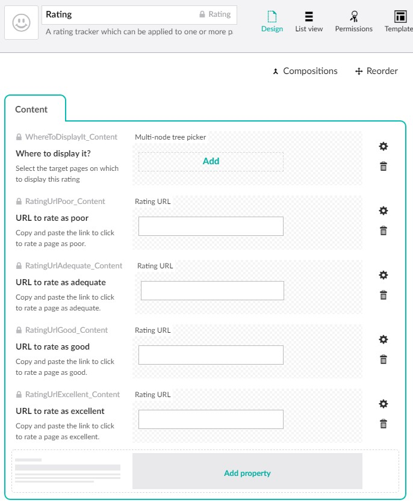
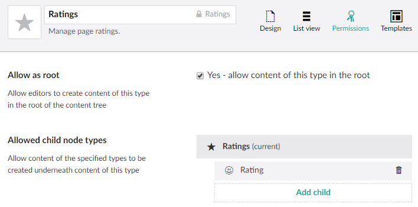
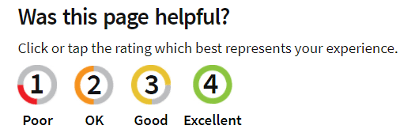

# Ratings (also known as Customer Thermometer)

Most document types offer users the chance to rate the page. This is built to work with [Customer Thermometer](https://www.customerthermometer.com/) but should be easily adaptable to another similar service. The four rating levels are simple links to another website.

## How it works

Create a document type with the alias `Rating` and the following properties:

*  Create a property called `Where to display it?` with the alias `WhereToDisplayIt_Content` which uses a multi-node tree picker property editor.
*  Create a data type called `Rating URL` using the URL property editor from [Escc.Umbraco.PropertyEditors](https://github.com/east-sussex-county-council/Escc.Umbraco.PropertyEditors/). You can optionally add a regular expression to ensure the URL is in the expected format for the third-party service. 
*  Create a property called `URL to rate as poor` with the alias `RatingUrlPoor_Content` using the `Rating URL` data type.
*  Create a property called `URL to rate as adequate` with the alias `RatingUrlAdequate_Content` using the `Rating URL` data type.
*  Create a property called `URL to rate as good` with the alias `RatingUrlGood_Content` using the `Rating URL` data type.
*  Create a property called `URL to rate as excellent` with the alias `RatingUrlExcellent_Content` using the `Rating URL` data type.

This is recognised by `RatingRelationEventHandler` to create an Umbraco relation between the rating and the pages selected in the multi-node tree picker field. 

Create another document type called `Ratings` which can only be placed at the root, and allows `Rating` as its only child document type. 

Each controller that needs to support 
ratings should create an instance of `RatingSettingsFromUmbraco`, and usually pass it to `BaseViewModelBuilder.PopulateBaseViewModelWithInheritedContent()`. This uses the relation created by `RatingRelationEventHandler` to look up the rating URLs for the page.

	using Escc.EastSussexGovUK.Umbraco.Web.Ratings;

	public new async Task<ActionResult> Index(RenderModel model)
    {
		var viewModel = new MyCustomModel();

		var templateRequest = new EastSussexGovUKTemplateRequest(Request);
		var modelBuilder = new BaseViewModelBuilder(templateRequest);
		modelBuilder.PopulateBaseViewModelWithInheritedContent(
			viewModel, null, null, null, null, 
			new RatingSettingsFromUmbraco(model.Content));

        return CurrentTemplate(viewModel);
	}

The result of this is that `viewModel.RatingSettings` has the URLs to rate the content (or `null` if there is no rating configured). Any template which supports rating should include the following at the end of the page:

	

	    @Html.Partial("~/Views/Layouts/_Rating.cshtml")
	

Setting up ratings support in this way rather than adding properties to each supporting document type enables ratings to be managed separately to pages. Access to manage the ratings can be controlled using Umbraco permissions on the content node that uses the `Ratings` document type. 
