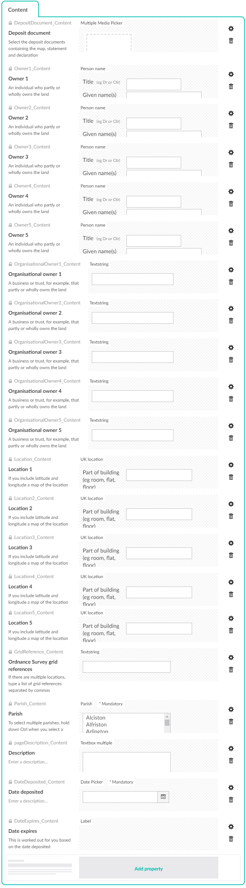
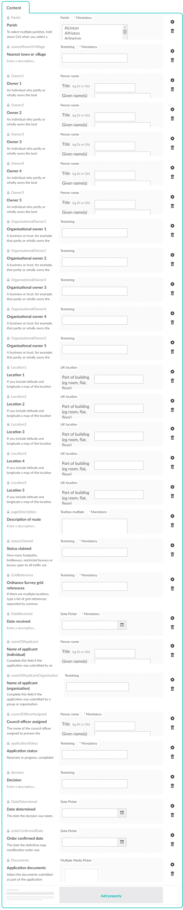

# Rights of way - Section 31 deposits and definitive map modifications

Two similar sets of document types and templates exist for the rights of way team to make available two types of document that they have a statutory duty to publish:

*  **Section 31 deposits** - Section 31 (6) of the Highways Act 1980 enables landowners to protect their land from gaining public rights of way through use by the public by depositing a map with the council.
*  **Applications for definitive map modification orders** - Section 53 of the Wildlife and Countryside Act 1981 enables anyone to apply for a modification to the definitive map of rights of way.

Each one requires four document types to be created:

*  **The document** - A document type with an alias of `RightsOfWayDeposit` or `RightsOfWayModification` which contains details of an individual deposit or application.  
*  **The CSV download** - A document type with an alias of `RightsOfWayDepositsCsv` or `RightsOfWayModificationsCsv` which provides a download of all fields in all instances of `RightsOfWayDeposit` or `RightsOfWayModification`.
*  **The RSS feed** - A document type with an alias of `RightsOfWayDepositsRss` or `RightsOfWayModificationsRss` which provides a feed of all instances of `RightsOfWayDeposit` or `RightsOfWayModification` that people can subscribe to for updates.
*  **The list view** - A document type with an alias of `RightsOfWayDeposits` or `RightsOfWayModifications` which is set to be a list view, and allows the other three document types as its only children. This should be allowed as a child of other common document types.

### The Rights of way Section 31 deposit document type

### The Rights of way definitive map modification document type

Create the `Parish` data type using the `Dropdown list multiple` property editor and a hard-coded list of parishes in East Sussex. 

Create the `Person name` and `UK location` data types using property editors made available by the [Escc.Umbraco.PropertyEditors](https://github.com/east-sussex-county-council/Escc.Umbraco.PropertyEditors/) NuGet package.

## Searching the rights of way data

For both types of document, the list view includes a search form on the template. This submits a `GET` request back to the same page so that the filtered results can be bookmarked or sent as a link, and so that the same filter can be applied to the RSS feed link to create a custom, filtered feed.

The search works using a dedicated Examine index for each type of document. You can set these up by transforming your copy of `~\config\ExamineIndex.config` and `~\config\ExamineSettings.config` with the `ExamineIndex.config.xdt` and `ExamineSettings.config.xdt` transforms in the `RightsOfWayDeposits` and `RightsOfWayModifications` folders. 

*  `ExamineIndex.config` lists the aliases of the properties which should be indexed, and every property should be listed because every property must be in the Examine index for the CSV export to publish it. Both the CSV and RSS feed read data from the Examine index because that is the fastest way. 

*  `ExamineIndex.config` also configures the properties which appear in the initial results to be sortable. Without this configuration, sorting the results will not work.

`RightsOfWayDepositsEventHandler` and `RightsOfWayModificationsEventHandler` hook up to Examine events to combine all relevant properties into one field in Examine, and it is this field which is searched when returning results.

Search results are paged using Examine's `Skip()` and `Take()` methods so that only the results required are selected, so it should remain fast as the number of results grows. However, once they are returned paging is managed by `PagingController` from [Escc.NavigationControls.WebForms](https://github.com/east-sussex-county-council/Escc.NavigationControls.WebForms) and uses a WebForms control to display the paging navigation. This is used across the website and works well, but should eventually be replaced by an MVC alternative.

## Calculating an expiration date for Section 31 deposits

For a Section 31 deposit there are statutory rules for how long the deposit is valid for. Rather than require editors to calculate and enter a date manually, `RightsOfWayDepositsEventHandler` uses `RightsOfWayDepositExpiryCalculator` to calculate the date when a page is saved. This is shown on the edit view for the page using the `Label` property editor, which does not allow any manual editing.