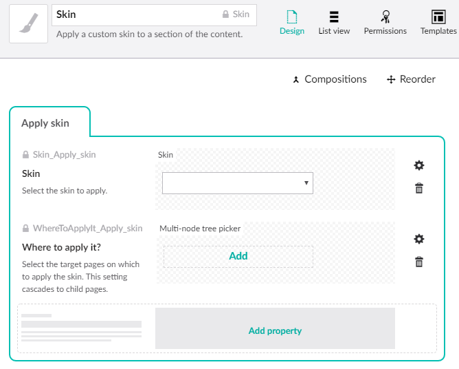
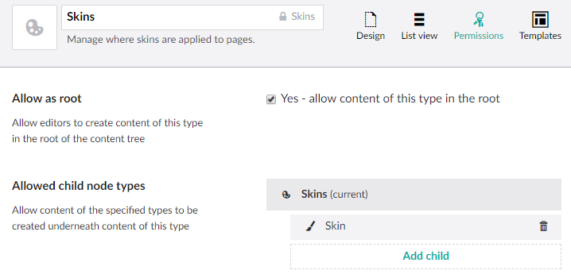

# Skins

Skins can be applied to any Umbraco template set up to support them to vary the look or behaviour of the template. This can be used to brand a section of the site without creating new, separate templates for that section.

Umbraco skins are built on the [sitewide support for skins in the Escc.EastSussexGovUK project](https://github.com/east-sussex-county-council/Escc.EastSussexGovUK/blob/master/DotNetFrameworkMvc.md#skins). 

Each skin class can specify CSS and JavaScript files to load, which can modify the page in any way, and content security policies to apply to allow those modifications to load. All of these are specified as aliases which reference a setting in `web.config`. See [Escc.ClientDependencyFramework](https://github.com/east-sussex-county-council/Escc.clientDependencyFramework) and [Escc.Web](https://github.com/east-sussex-county-council/Escc.Web/blob/master/ContentSecurityPolicy.md) for details of how to configure these. 

Each template that should support skins must contain code similar to the following early in the view:

	@{
	    Model.EsccWebsiteSkin = SkinSelector.SelectSkin(new IEsccWebsiteSkin[] 
		{
	        new RegistrationAcademySkin(Model.SkinToApply == "Registration Academy"),
	        new SupportWithTrustSkin(Model.SkinToApply == "Support with trust")
        }, 
		new CustomerFocusSkin());
	} 

This specifies a list of all the skins supported by the template (usually more than the two shown here) in the order they should be considered, followed by a fallback skin that will be used should none of the others be applied.

## Determining which skin to apply on a page

A skin class inherits from `IEsccWebsiteSkin` and can use any criterion to decide whether it is appropriate. Older skins look for a hard-coded URL. However, more recent skins expect a `bool` which can be based on a check of the `Model.SkinToApply` property as shown above, which allows control of where they're applied to be passed to editors.

`Model.SkinToApply` is populated when any controller calls `BaseViewModelBuilder.PopulateBaseViewModel` passing an instance of `SkinFromUmbraco`:

	var templateRequest = new EastSussexGovUKTemplateRequest(Request);	
	var modelBuilder = new BaseViewModelBuilder(templateRequest);
    await modelBuilder.PopulateBaseViewModel(
					viewModel, 
					model.Content, 
					null, null,
	                UmbracoContext.Current.InPreviewMode, 
					new SkinFromUmbraco()
	);

Create a document type with the alias `Skin` and just two properties:

*  Create a dropdown list data type of skin names (or use a text field) with the alias `Skin_Apply_skin`.
*  A multi-node tree picker with the alias `WhereToApplyIt_Apply_skin`.

This is recognised by `SkinRelationEventHandler` to create an Umbraco relation between the skin and the pages selected in the multi-node tree picker field, and it is this relation that `SkinFromUmbraco` uses to look up the skin for the page. 

Create another document type called `Skins` which can only be placed at the root, and allows `Skin` as its only child document type. This groups all the skins in one place on the site, so that you can limit who can apply skins by controlling the permissions for that page. 

