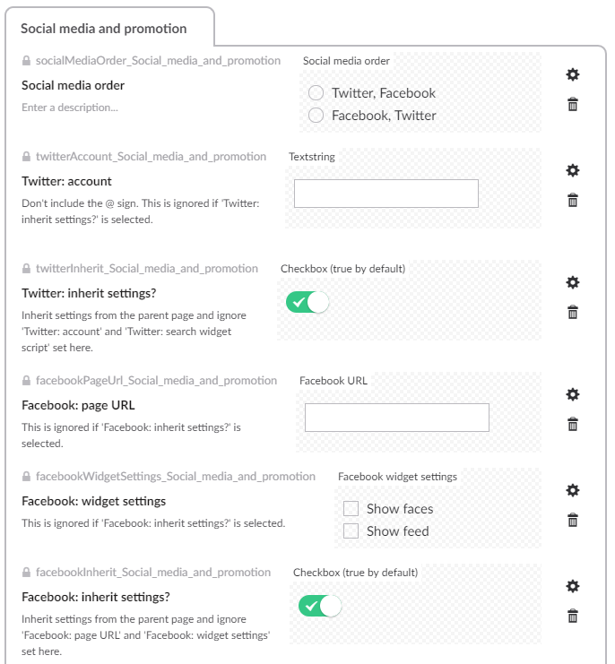

# Social media support

## Embedding social media feeds

Most templates in Umbraco support displaying feeds from Facebook pages and Twitter accounts.

Wherever you want to configure these feeds you need to create custom data types, and several properties on your document type which are usually placed on a 'Social media and promotion' tab:

*  Create a data type called `Social media order` using the `Radio button list` property editor, with two pre-values for `Twitter, Facebook` and `Facebook, Twitter`.
*  Create a data type called `Facebook widget settings` using the `Checkbox list` property editor, with two pre-values for `Show faces` and `Show feed`.
*  Create a property called `Social media order` with an alias of `socialMediaOrder_Social_media_and_promotion` using the `Social media order` data type. 
*  Create a property called `Twitter: account` with an alias of  `twitterAccount_Social_media_and_promotion` using the `Textstring` property editor.
*  Create a property called `Twitter: inherit settings?` with an alias of `twitterInherit_Social_media_and_promotion` using a checkbox data type set to default to checked.
*  Create a property called `Facebook: page URL` with an alias of `facebookPageUrl_Social_media_and_promotion` using the `Textstring` property editor.
*  Create a property called `Facebook: widget settings` with an alias of `facebookWidgetSettings_Social_media_and_promotion` using the `Facebook widget settings` data type.
*  Create a property called `Facebook: inherit settings?` with an alias of `facebookInherit_Social_media_and_promotion` using a checkbox data type set to default to checked.

In a new installation you would create the 'Social media and promotion' tab as a separate document type and add it as a [composition](https://our.umbraco.com/documentation/Getting-Started/Data/Defining-content/#creating-a-document-type) to other document types. However, this was set up before compositions were available in Umbraco, so the fields are defined separately on different document types, including some parent document types (which is a feature replaced by compositions).

Each controller that needs to support Facebook and Twitter feeds should create an instance of `UmbracoSocialMediaService`, and usually pass it to `BaseViewModelBuilder.PopulateBaseViewModelWithInheritedContent()`. This evaluates the all of the options created above, recursing up the hierarchy of content nodes to determine whether and how to display each feed, and then sets the `SocialMedia` property of the model.

	public new async Task<ActionResult> Index(RenderModel model)
    {
		var viewModel = new MyCustomModel();

		// Populate the view model with social media settings
		var templateRequest = new EastSussexGovUKTemplateRequest(Request);
		var modelBuilder = new BaseViewModelBuilder(templateRequest);
		modelBuilder.PopulateBaseViewModelWithInheritedContent(viewModel, 
                null,  
				new UmbracoSocialMediaService(model.Content), 
				null, null, null);

        return CurrentTemplate(viewModel);
	} 

Include the following partial view in any template which needs to display the forms:

	@Html.Partial("~/Views/Layouts/_SocialMedia.cshtml")

This partial view loads other partial views which are part of the [Escc.EastSussexGovUK.Mvc](https://github.com/east-sussex-county-council/Escc.EastSussexGovUK/blob/master/DotNetFrameworkMvc.md#add-common-features-to-pages-using-partial-views) project.

Note that some document types (for example, the home page) may allow entry of social media settings without displaying them. This makes sense as the social media might be configured to cascade to all pages below that page.

# Sharing pages on social media

To add social media share links to the bottom of any template, include the following partial view:

	

    	@Html.Partial("~/Views/EastSussexGovUK/Features/_Share.cshtml")
	

This partial view is part of the [Escc.EastSussexGovUK.Mvc](https://github.com/east-sussex-county-council/Escc.EastSussexGovUK/blob/master/DotNetFrameworkMvc.md#add-common-features-to-pages-using-partial-views) project.