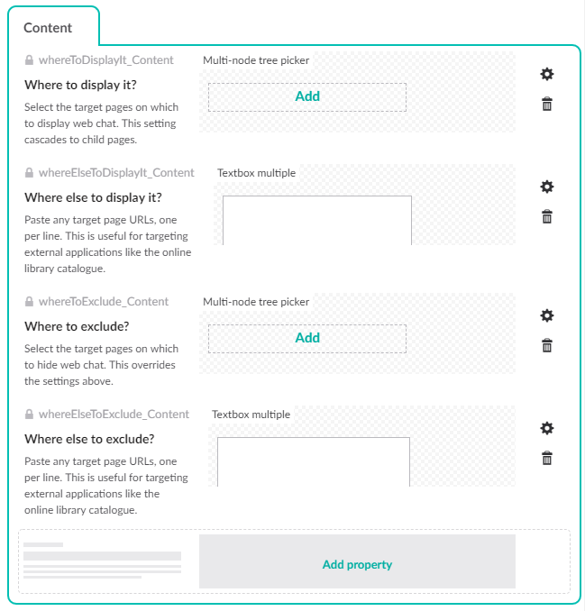

# Web chat

Web chat support for our site is implemented by the [Escc.EastSussexGovUK](https://github.com/east-sussex-county-council/Escc.EastSussexGovUK/blob/master/WebChat.md) project and documented there, but the settings are managed by editors here in Umbraco.  

To enable this create a document type called `Web chat` with an alias of `WebChat` which is allowed only at the root of the site, and add the following properties:

*  A property called `Where to display it?` with an alias of `whereToDisplayIt_Content` which uses the multi-node tree picker property editor.
*  A property called `Where else to display it?` with an alias of `whereElseToDisplayIt_Content` which uses the `Textbox multiple` property editor.
*  A property called `Where to exclude?` with an alias of `whereToExclude_Content` which uses the multi-node tree picker property editor.
*  A property called `Where else to exclude?` with an alias of `whereElseToExclude_Content` which uses the `Textbox multiple` property editor.

Adding duplicate properties using `multi-node tree picker` and `textbox multiple` property editors allows pages to be selected either by selecting Umbraco content or by pasting URLs, one per line, from any application that forms part of the website.

`Escc.EastSussexGovUK` has `WebChatSettingsFromApi`, which reads settings from an API implemented by `WebChatController` in this project. `WebChatController` reads its settings from Umbraco by looking for an instance of the document type described above.

## Web chat support is different on an Umbraco page

Website page controllers outside Umbraco should use `WebChatSettingsFromApi` to get the settings for where web chat should be enabled. That API uses `UmbracoWebChatSettingsService` to query the Umbraco cache, but controllers in this project have direct access to the Umbraco cache so they can skip the API and create an instance of `UmbracoWebChatSettingsService` directly:

	using Escc.EastSussexGovUK.Mvc;
	using Escc.EastSussexGovUK.Umbraco.Web.Services;
	using Escc.Umbraco.PropertyTypes;

	public new async Task<ActionResult> Index(RenderModel model)
    {
		var viewModel = new MyCustomModel();

		var webChat = new UmbracoWebChatSettingsService(model.Content, new UrlListReader());
		var templateRequest = new EastSussexGovUKTemplateRequest(Request, webChatSettingsService: webChat);

        return CurrentTemplate(viewModel);
	} 

Any template that wants to support web chat then needs to use an instance of `WebChat` to read the settings, determine whether web chat is enabled for the page, and identify the CSS, JavaScript and content security policy to load from `web.config`.

	@using Escc.EastSussexGovUK.Features

	@{
		Html.Partial("~/Views/EastSussexGovUK/_FeatureDependencies.cshtml", new List<IClientDependencySet>()
	    {
	        new WebChat() { WebChatSettings = Model.WebChat }
	    });
	}